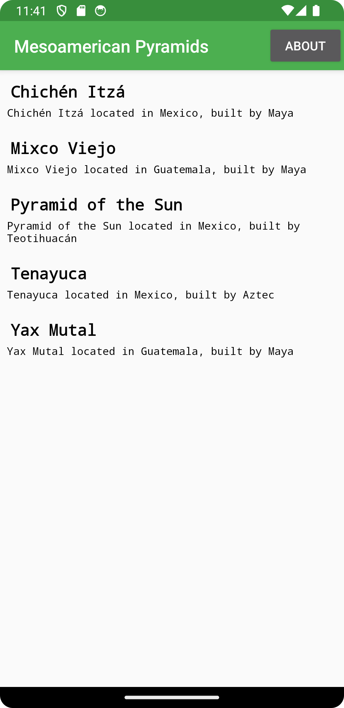
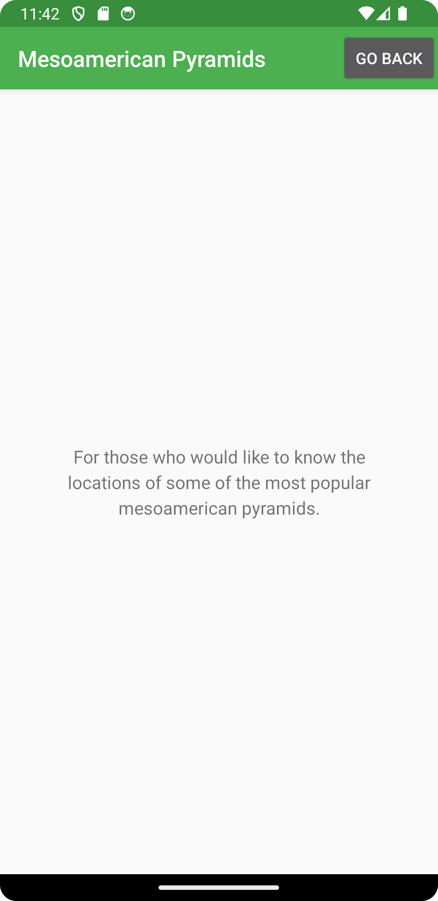

# Report

## Each commit described

### 1. JsonTask
JsonTask.java added from the previous assignment. 

### 2. AboutActivity
Activity created for the about page. This includes activity_about.xml, AboutActivity.java and an entry in AndroidManifest.xml.
The java file was forgotten until the Recycler Adapter was created. 

### 3. Toolbar Button
Adds a button to the MainActivity, containing logic to redirect you to the about page.
Initially this looks horrible because the button is placed wrongly in the xml. this is fixed in the next commit.

### 4. Toolbar Button both ways
Implements the same button the same way in the AboutActivity, redirecting you back to the main activity.
Also fixes the position of both buttons so they fit nicely inside the toolbar. 

### 5. Successful JSON retrieval
This commit enables internet access and successfully retrieves the data from the internet. 
The JsonFile.java was added here but is later removed. 
It also changes the title to a semi-appropriate name "Meso-American Temples".

### 6. Temple class
The temple class is created to enable demarshalling of the JSON. It contains the required variables and a simple toString() override. 

### 7. Gson
A list of temples is created to contain the demarshalled data. Using the Gson library the data is put into objects of type 'temple'. 

### 8. Recycler Adapter + forgotten file
AboutActivity is added to git here. 
A whole new class 'MyAdapter' is added for the RecyclerView. This implementation has a single TextView displaying the toString() of each temple. 
recycler_view_item.xml contains a simple monospaced layout for the text. 

### 9. Working recyclerView
The centered TextView in the main activity is now replaced with a RecyclerView. 
The setTempleList method inside MyAdapter is modified to properly display the content using notifyDataSetChanged();

### 10.  titles
Modifies MyAdapter to contain an additional text view for titles for each temple. 
This also requires an additional TextView to be added to recycler_view_item.xml, and a small getter for the temple name.

### 11. formatting
Changes colors of the toolbar and the app icon, with other small changes.
Realization that the data are pyramids, not temples, so title gets changed.

### 12. Pyramidification
Changes all mentions of temples to pyramids. 

## Relevant Code 

### AboutActivity
```java
public class AboutActivity extends AppCompatActivity {
    @Override
    protected void onCreate(Bundle savedInstanceState) {
        super.onCreate(savedInstanceState);
        setContentView(R.layout.activity_about);
        Toolbar toolbar = findViewById(R.id.toolbar);
        setSupportActionBar(toolbar);

        Button aboutButton = findViewById(R.id.back_button);
        aboutButton.setOnClickListener(new View.OnClickListener() {
            @Override
            public void onClick(View v) {
                Intent intent = new Intent(AboutActivity.this, MainActivity.class);
                startActivity(intent);
            }
        });
    }
}
```
### Pyramid class
```java
public class Pyramid {
    private String id;
    private String name;
    private String company;
    private String location;

    public String getName(){
        return name;
    }

    @NonNull
    @Override
    public String toString() {
        return String.format("%s located in %s, built by %s", name, location, company);
    }
}

```
### Recycler Adapter
```java
public class MyAdapter extends RecyclerView.Adapter<MyAdapter.ViewHolder> {

    private ArrayList<Pyramid> pyramidList;

    public MyAdapter() {
        this.pyramidList = new ArrayList<>();
    }

    public static class ViewHolder extends RecyclerView.ViewHolder {

        TextView title;
        TextView content;
        public ViewHolder(View view) {
            super(view);
            content = itemView.findViewById(R.id.text_view_item);
            title = itemView.findViewById(R.id.item_title);
        }
    }

    @NonNull
    @Override
    public ViewHolder onCreateViewHolder(@NonNull ViewGroup viewGroup, int i) {
        View view = LayoutInflater.from(viewGroup.getContext()).inflate(R.layout.recycler_view_item, viewGroup, false);
        return new ViewHolder(view);
    }

    @Override
    public void onBindViewHolder(@NonNull ViewHolder viewHolder, int i) {
        viewHolder.title.setText(pyramidList.get(i).getName());
        viewHolder.content.setText(pyramidList.get(i).toString());

    }

    @Override
    public int getItemCount() {
        return pyramidList.size();
    }

    public void setPyramidList(ArrayList<Pyramid> list){
        this.pyramidList.clear();
        this.pyramidList.addAll(list);
        notifyDataSetChanged();
    }
}
```
### Json process
``` java
@Override
public void onPostExecute(String json) {

    Gson gson = new Gson();
    Type type = new TypeToken<ArrayList<Pyramid>>() {}.getType();
    ArrayList<Pyramid> temp = gson.fromJson(json, type);
    adapter.setPyramidList(temp);
    Log.d("MainActivity", json);

}
```

## Fancy pictures

 

 


